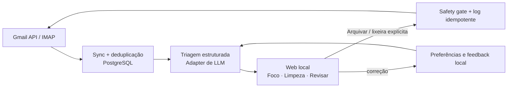

# Revisão e roadmap: email-helper focado

Revisão iniciada em 09/08/2026 e atualizada em 10/08/2026. Escopo: simplificar o produto para uma pessoa que
administra várias caixas e quer uma Inbox calma, com IA local. Esta revisão não
removeu mensagens nem contas; artefatos dos modelos e a tabela de treino foram removidos.

## Decisão de produto

O produto deve deixar de ser um **classificador que cria destinos** e virar um
**assistente de foco para decidir o que fazer na Inbox**.

| Estado | Onde vive | Significado | Próxima ação |
| --- | --- | --- | --- |
| **Foco** | Inbox do provedor | Requer atenção, resposta, decisão ou tem prazo. | Resolver, adiar ou arquivar. |
| **Outros** | Inbox, sem destaque | Não exige atenção agora. | Arquivar quando encerrado. |
| **Arquivo** | `Archive` nativo | Concluído ou não necessário agora; continua pesquisável. | Restaurar se voltar a importar. |
| **Revisar** | Fila local | O agente não tem certeza suficiente. | Confirmar Foco ou Outros. |
| **Spam suspeito** | Estado local e, se desejado, única quarentena | Sinal de cautela; nunca descarte automático. | Confirmar ou criar regra. |

Fiscal, documento, marketing, promoção e fraude ainda são bons **metadados
locais** para busca, explicação e aprendizado, mas não devem virar pasta/label.
Isso reduz os dez labels `AI/*` anteriores para `AI/Foco` (opcional) e
`AI/Spam Suspeito` (opcional). `Archive` é nativo, não um label AI; `Revisar`
é uma fila local. Não há requisito de retrocompatibilidade com o fluxo antigo.

### Arquivo único

O Canary trata arquivamento como o meio-termo entre manter na Inbox e apagar:
retira o item da visão de trabalho, mantém acesso e permite restaurar. Também
suporta conversa e lote. É o comportamento desejado; não é preciso uma árvore
por assunto. [Fonte: Canary](https://canarymail.io/blog/mac-mail-message-archiving).

No Gmail, arquivar deve apenas remover `INBOX`, preservando labels e a busca em
*All Mail*. Em IMAP, deve usar a pasta especial `Archive` do servidor; criar um
fallback configurável somente quando ela não existir.

A inspeção real das contas IMAP encontrou uma pasta `Archives` anunciada com
`SPECIAL-USE \\Archive`; nas demais aparecia apenas `AI.Archive`, criada pelo
agente antigo, e uma conta não tinha arquivo. A implementação agora prioriza a
flag, reconhece `Archive`, `Archives` e `Arquivados`, e cria `Archive` somente
quando necessário. Assim ela reutiliza o arquivo reconhecido pelo Canary e não
cria uma pasta concorrente.

## Diagnóstico do código

### Manter

- Gmail API, IMAP, deduplicação, cursores e isolamento de falhas por conta.
- `secrets/accounts.yml`: as contas já estão declaradas e podem ser reimportadas;
  não é preciso recadastrá-las.
- PostgreSQL, IDs internos, log de ações idempotentes e safety gate.
- Adapter agnóstico de LLM, Ollama como opção local, parser/MIME cleaner,
  resumos e regras por conta.
- Typer e a TUI atual como compatibilidade operacional.
- A política de nunca apagar/mover automaticamente para Lixeira ou Spam.

### Simplificar

| Componente | Situação | Direção |
| --- | --- | --- |
| Celery, Valkey, worker e beat | Três processos de aplicação para uma rotina pessoal previsível. | **Removidos**; `agent run` executa sync e triagem em sequência. |
| FastAPI | Hoje só expõe saúde e status administrativo. | Manter como servidor da interface web local. |
| LangGraph | O grafo era linear. | **Removido**; pipeline Python explícito. |
| Label Studio | Outro serviço e outra fila de revisão. | **Removido**; a fila do produto é a revisão humana. |
| Langfuse | Útil para diagnóstico, não para operar Inbox. | Opt-in, desligado por padrão. |
| Dois modelos sklearn e treino noturno | Complexidade prematura. | **Removidos**; uma chamada estruturada à LLM configurada faz a triagem. |
| WhatsApp diário | Bom alerta, má superfície de decisão. | Opcional, apenas apontando para a fila local. |

Essa poda também removeu broker, workers, dependências pesadas de ML, comandos
de treino, a camada LangChain e toda a integração/documentação do Label Studio.
O cliente chama diretamente Ollama ou uma API compatível com OpenAI por um
contrato único de configuração.

### Pontos a corrigir durante a migração

- Documentação antiga fala em cópia IMAP; a implementação atual move para uma
  pasta por prioridade. A nova semântica será única: Arquivar move e é
  reversível; Foco/Revisar não movem.
- O autoarquivamento noturno de itens importantes/documentos lidos após 180 dias
  foi removido; arquivar agora exige comando explícito do usuário.
- `secrets/accounts.yml` é necessário na configuração inicial e já é ignorado
  pelo Git. O `AGENTS.md` agora proíbe agentes de abrir, pesquisar, imprimir ou
  copiar seu conteúdo; conectores podem consumi-lo sem expor credenciais.

## Interface: web local

**Recomendação revisada: interface web local servida pelo FastAPI.**

O fluxo valorizado no Canary — rolar uma lista rica, ver remetente, título e
início do corpo, corrigir uma pré-seleção e confirmar uma única exclusão em lote
— é mais natural no navegador. TUI continua boa para configuração e diagnóstico,
mas perde em seleção por mouse, densidade de snippet, scroll longo e feedback
visual. Electron não agrega capacidade: empacota Chromium e aumenta memória,
distribuição e atualização. Se um app desktop for desejado depois, a mesma web
local pode ser empacotada só após o produto estar validado.

A tela principal de limpeza deve ter:

- lista paginada/infinita com checkbox, conta, remetente, assunto, data, snippet
  e motivo da sugestão;
- botão explícito para selecionar itens `cleanup_candidate=true`; os demais
  permanecem visíveis e podem ser selecionados manualmente;
- seleção persistente enquanto o usuário rola e uma barra fixa com contagem;
- seleção do viewport, desseleção total e intervalo com Shift-clique;
- filtros por conta, categoria, prioridade e período, além de ordenação por data
  ou prioridade;
- botão único **Mover selecionados para a Lixeira**, seguido de confirmação com
  contagem por conta;
- falha de uma conta não bloqueia as outras; o resultado informa sucesso/erro
  por mensagem;
- nenhuma exclusão ao classificar, carregar ou rolar. Só o clique final chama o
  caminho explícito, recuperável e idempotente de Lixeira.

O frontend pode ser uma SPA pequena compilada para assets estáticos e servida
pelo FastAPI. Em runtime continuam apenas aplicativo e PostgreSQL; o navegador
já existente é o cliente.

## Busca e persistência da IA

A busca local já está preparada para a web sem Elasticsearch ou outro serviço:

- `search_vector` gerado pelo PostgreSQL combina assunto, remetente e corpo;
- assunto tem peso A, remetente B e corpo C;
- GIN atende full-text e `pg_trgm` atende fuzzy match/typos;
- índices compostos cobrem deduplicação, threads, digest, limpeza e revisão;
- cada mensagem tem no máximo uma classificação atual.

A classificação atual preserva o resultado da leitura da IA, provider, modelo,
versão do prompt, resposta bruta, tokens, latência e erro. Busca semântica não
entra nesta etapa: a imagem atual não usa `pgvector` e ainda não há contrato de
modelo/dimensão de embeddings. Adicionar uma coluna vetorial sem populá-la seria
complexidade sem produto; full-text e trigram já resolvem conteúdo e erros de
digitação. Embeddings devem entrar somente com caso de uso e avaliação de recall.

## Dove: recursos observados e decisão

As descrições foram levantadas dos popovers da página de preços em 09/08/2026.
Elas descrevem comportamento observado, não código a copiar.
[Fonte: Dove pricing](https://dove.email/pricing).

### Focus

| Recurso | O que faz no Dove | Direção |
| --- | --- | --- |
| Smart Inbox | Separa mensagens em Focus, Feed e Noise e aprende entre contas. | Adotar como Foco/Outros/Revisar; Feed/Noise serão metadados, não pastas. |
| Wingman AI | Mostra impacto, histórico, tom e próximo passo ao lado do e-mail de foco. | Adotar como painel sob demanda com Ollama local. |
| Smart Notifications | Notifica apenas quando precisa resposta, com resumo e ação sugerida. | Depois; nunca a partir de classificação incerta. |
| Summaries | Resume e-mails e threads automaticamente. | Adotar sob demanda; pré-gerar só Foco/Revisar. |
| Notification Summaries | Troca assunto por resumo de uma linha na notificação. | Depois, junto a notificações locais. |
| Memory | Uma preferência ou instrução passa a valer daqui em diante. | Adotar sobre `rules.yml`, com confirmação. |
| Attachment Analysis | Lê PDF, Word e planilha para briefs, drafts e busca. | Fase posterior: faltam extração local e limites seguros. |
| Smart Labels | Classifica pelo conteúdo e padrões, sem criar regras. | Adotar o princípio, materializando no banco. |
| Custom Rules | Aprende com correção ou aceita regra em linguagem natural. | Adotar; correções sugerem regra editável. |

### Act

| Recurso | O que faz no Dove | Direção |
| --- | --- | --- |
| Daily Task List | Extrai ações, agrupa por projeto e ordena urgência diariamente. | Fase 2: primeiro mostrar próxima ação por e-mail. |
| Task Management | Cria, conclui e acompanha tarefas dentro do cliente. | Não reproduzir no MVP; integrar depois se necessário. |
| Handoff Briefs | Gera handover com contexto, estado e próximos passos de uma thread. | Adotar como `brief E-...`, sob demanda e copiável. |
| Automations | Executa instruções como arquivar newsletters após 24h. | Depois, apenas ações reversíveis e confirmadas. |
| Meeting Detection | Extrai pedido de reunião enterrado em thread e o torna acionável. | Depois, como sinal de Foco; sem criar evento automaticamente. |
| Bulk Actions | Seleciona/descreve mensagens e arquiva, move ou altera em lote. | Adotar cedo para Arquivar/Restaurar e Lixeira recuperável, sempre com prévia e confirmação. |

### Compose

| Recurso | O que faz no Dove | Direção |
| --- | --- | --- |
| Drafts | Gera resposta ou e-mail completo a partir de pouco contexto. | Adotar: rascunho local, nunca envio automático. |
| Writing Style | Aprende vocabulário, tom e fraseado dos enviados. | Fase 3, opt-in; iniciar com perfis editáveis. |
| Replies | Sugere direções de resposta antes do compositor. | Adotar sob demanda no painel Foco. |
| Wingman Review | Aponta erros, lacunas de contexto e arrependimentos antes de enviar. | Adotar para revisar rascunho local. |
| Read Receipts | Indica quando o destinatário abriu. | Não reproduzir: depende de rastreamento e não combina com privacidade. |
| Aliases | Disponibiliza aliases Gmail/Microsoft como remetentes. | Preservar suporte de provedor, sem IA. |
| Custom Signatures | Usa assinatura diferente para cada conta. | Fase 2, configuração local por conta. |
| Undo Send | Cancela por cinco segundos após enviar. | Delegar ao provedor/cliente; não é confiável via IMAP. |

## Arquitetura-alvo

O fluxo normal será `agent run`: sincroniza, atualiza a fila e gera digest
opcional. PostgreSQL é o único serviço obrigatório; Ollama pode seguir nativo no
host ou ser substituído por endpoint compatível. Langfuse é opt-in.

## Roadmap

### Fase 0 — proteger e decidir

1. Backup de PostgreSQL, `data/` e `secrets/`.
2. Preservar `accounts.yml` local e garantir que agentes nunca o inspecionem.
3. Manter somente `AI/Foco` e `AI/Spam Suspeito` como labels opcionais no provedor.
   **Implementado.**
4. Desativar autoarquivamento até existir prévia e desfazer. **Implementado.**
5. Guardar exemplos privados de Foco/Outros/Revisar para regressão, sem corpos
   de e-mail em fixtures versionadas.

Saída: contas importáveis pelo YAML e nenhuma ação automática movendo mensagens.

### Fase 1 — núcleo leve e arquivo nativo

1. Concluir migration da triagem com `cleanup_candidate` e motivo. **Implementado.**
2. Usar uma única chamada estruturada à LLM e falhar para Revisar quando a
   resposta for inválida ou pouco confiante. **Implementado.**
3. Remover sklearn, treino, Label Studio, LangGraph, Celery e Valkey.
   **Implementado.**
4. Usar arquivo nativo Gmail/IMAP compatível com `SPECIAL-USE \\Archive`.
   **Implementado; falta restaurar/desfazer.**
5. Manter sugestões de limpeza somente no banco, sem aplicar label ou mover a
   mensagem. **Implementado.**
6. Adicionar busca full-text/fuzzy e persistir metadados completos da leitura da
   IA. **Implementado.**

Saída atual: arquivar funciona e é testado em Gmail e IMAP; restaurar/desfazer
permanece para a Fase 2. Não são criadas automaticamente pastas AI para
documento, marketing ou fiscal.

### Fase 2 — web de limpeza em lote

1. Criar endpoints paginados de candidatos e seleção, sem retornar corpo além do
   snippet necessário. **Implementado.**
2. Construir a lista com pré-seleção conservadora, filtros e barra de ação fixa.
   **Implementado.**
3. Implementar Lixeira em lote com uma confirmação, log/idempotência por item e
   resultado parcial por conta. **Implementado.**
4. Adicionar Arquivar/Restaurar, Foco/Outros/Revisar e desfazer.
5. Manter a TUI atual apenas para contas, regras e diagnóstico.

Saída: o usuário rola, corrige a seleção e move tudo escolhido para a Lixeira
com um único gesto final, sem qualquer exclusão automática.

### Fase 3 — composição útil

1. `reply`/`compose` sob demanda, direções de resposta, perfis de estilo
   explícitos e assinaturas por conta.
2. Revisão local do rascunho antes de o usuário enviar pelo cliente/provedor.
3. `brief` de thread e próxima ação, sem duplicar um gestor de tarefas inteiro.
4. Extração local de PDF/texto com limites de tamanho e retenção explícita.

Saída: a IA economiza leitura e redação, mas não envia nem executa ações
irreversíveis sozinha.

### Fase 4 — remover peso comprovadamente dispensável

1. Documentar e instalar o agendamento `launchd` quando os horários forem
   validados.
2. Medir custo/latência da LLM; só reintroduzir roteamento por modelo se os dados
   mostrarem necessidade real.
3. Manter Langfuse estritamente opt-in e avaliar retenção/redação de prompts.

Saída: instalação normal = PostgreSQL + aplicativo + Ollama nativo.

## Reset local opcional

O YAML de contas deve ser preservado. Para reiniciar apenas e-mails de teste, o
comando futuro deve: parar agendamento, mostrar contagens, criar backup, limpar
somente mensagens e entidades derivadas, manter contas (e definir cursores para
resync), pedir confirmação explícita e rodar `sync all --bootstrap` com janela
curta. Ele não deve tocar mensagens no provedor.

## Métricas de sucesso

- Menos de 60 segundos entre abrir a web e ver os candidatos de limpeza.
- Máximo de três estados/pastas visíveis além das nativas do provedor.
- Todas as ações no provedor rastreáveis e reversíveis quando tecnicamente
  possível; zero ações destrutivas automáticas.
- A LLM configurada faz uma passagem estruturada por mensagem nova; não há modelo
  estatístico, treino ou segunda fila de classificação.
- Operação normal com PostgreSQL e um processo do aplicativo.
